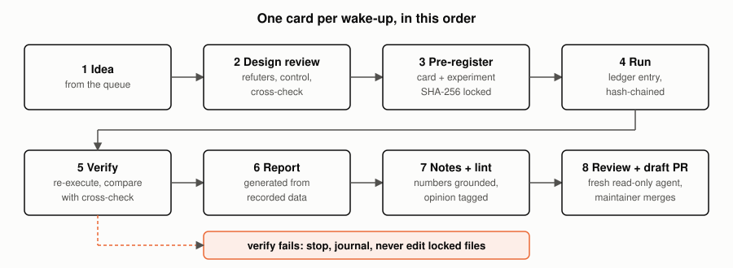
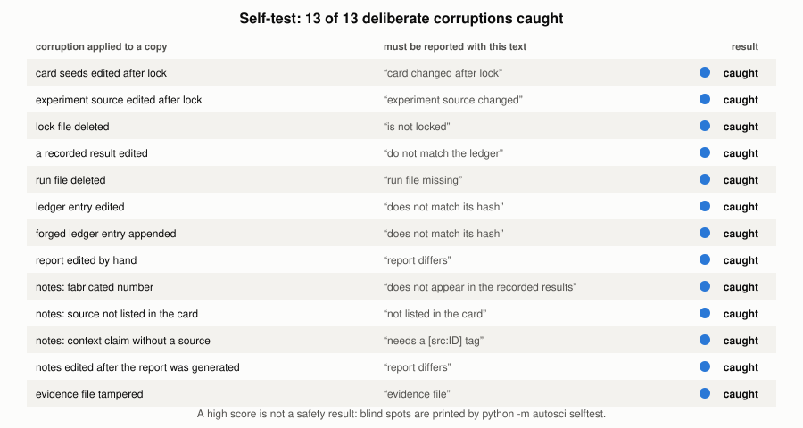
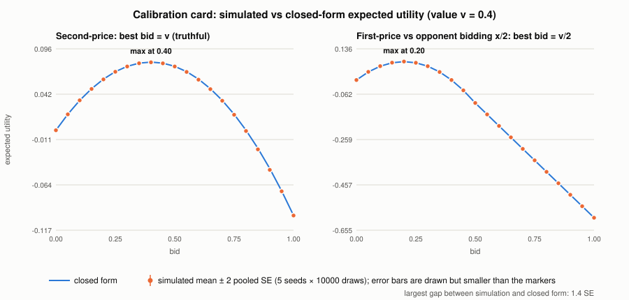
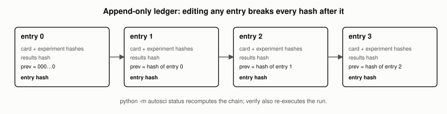
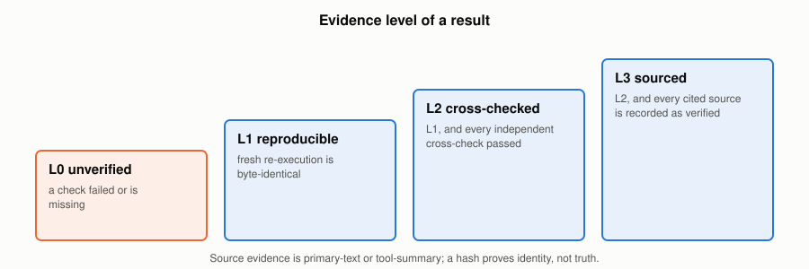
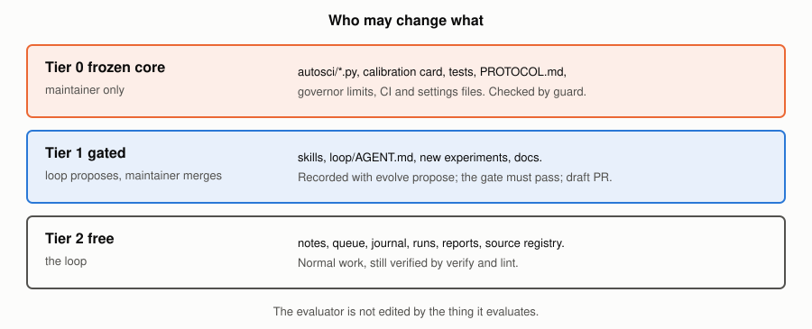

# Architecture

## Modules

| module | role |
|---|---|
| `autosci/card.py` | card schema and validation |
| `autosci/canon.py` | canonical JSON and hashing |
| `autosci/runner.py` | lock, run, verify; computes the evidence level |
| `autosci/ledger.py` | append-only, hash-chained ledger |
| `autosci/report.py` | report generated from recorded data only |
| `autosci/lint.py` | notes: every number grounded, every background claim sourced |
| `autosci/sources.py` | source registry and evidence hashes |
| `autosci/governor.py` | stop conditions: dry cards, lineage depth, trailing inconclusive results |
| `autosci/calibration.py` | how often predicted verdicts matched |
| `autosci/guard.py` | frozen-core manifest and comparison with an approved base |
| `autosci/selftest.py` | deliberate corruptions; the verifier must notice each |
| `autosci/evolve.py` | variant archive and gate for changes to the framework |
| `autosci/cli.py` | `python -m autosci <command>` |

Standard library only.

## Why the checks are shaped this way

Each check exists because a particular failure is easy for an automated researcher to
produce and hard for a reader to see.

| failure | what catches it |
|---|---|
| hypothesis or analysis chosen after seeing data | card and experiment hashed before the run |
| result edited afterwards | hash-chained ledger, run file compared with the ledger |
| a result that only the code that produced it agrees with | independent `crosscheck`, calibration card with closed-form answers |
| report that says more than the data | report generated from recorded data; notes lint |
| invented citation | source registry; verified sources carry the text that was read |
| the checker itself weakened | frozen core manifest and `guard`; evolve gate |
| a verifier that no longer catches anything | `selftest` corrupts a copy and requires detection |

## Trust

`state/protected.json` lists the frozen core and its hashes. `.claude/settings.json`
denies edits to it in Claude Code, and `guard --base` reports differences in CI.
Neither is a sandbox: a process with shell access can still write to disk. The
guarantee that matters is that a change to the frozen core is visible in the pull
request and needs the maintainer.

## Using it from an AI agent

| file | for |
|---|---|
| `AGENTS.md` | any coding agent; short rules and commands |
| `CLAUDE.md` | Claude Code; imports `AGENTS.md` |
| `.claude/skills/autoscientists/` | the loop procedure; companion skills `autosci-card-design`, `autosci-sources` |
| `.claude/agents/autosci-reviewer.md` | read-only reviewer (`tools: Read, Grep, Glob`) |
| `.claude/settings.json` | permission allow/deny rules |

## What is not covered

See section 9 of `PROTOCOL.md`: the checks do not establish that the question is the
right one, that a model fits reality, or that a source is correct. The reviewer is the
same model family as the author, so it is weaker than review by a person.

## FAQ

**Does this stop an AI from hallucinating?** No. It makes some kinds of unsupported
output detectable: edited results, unsupported numbers, uncited background, claims whose
only check is the code that made them. Interpretation remains unverified and is
labelled that way.

**Why standard library only?** So that a result can be re-executed years later and the
verifier has no dependency to trust.

**Can I run it without an AI?** Yes. Every step is a command; see `docs/TUTORIAL.md`.

**How is it used by others?** Fork it, put ideas in `state/QUEUE.md`, and run the skill
from Claude Code or any agent that reads `AGENTS.md`. Frozen-core changes always need
the maintainer.

**What if verification fails?** The loop stops, journals it, and never edits locked
files. A wrong design is replaced with a new card that sets `supersedes`.
